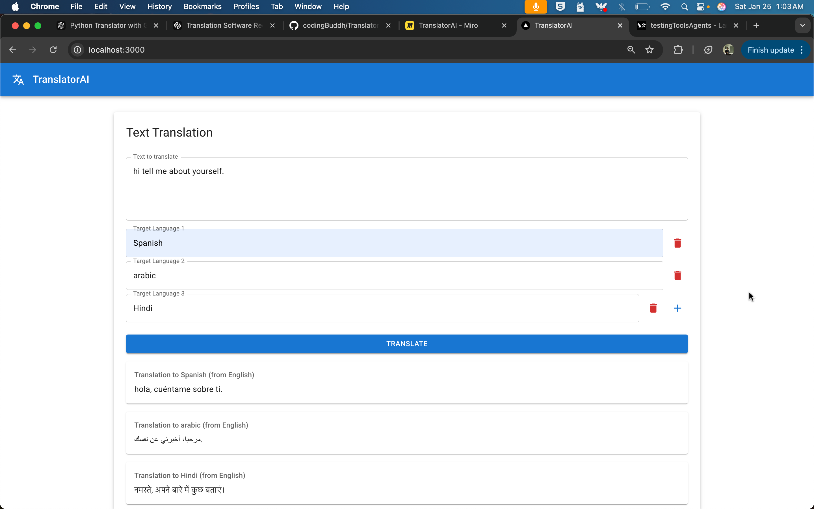
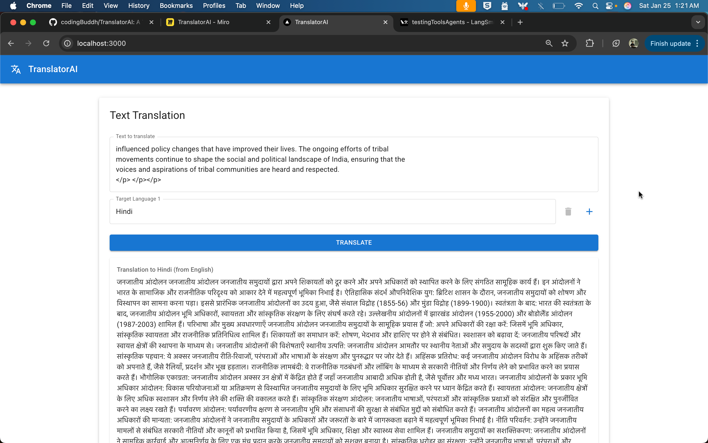
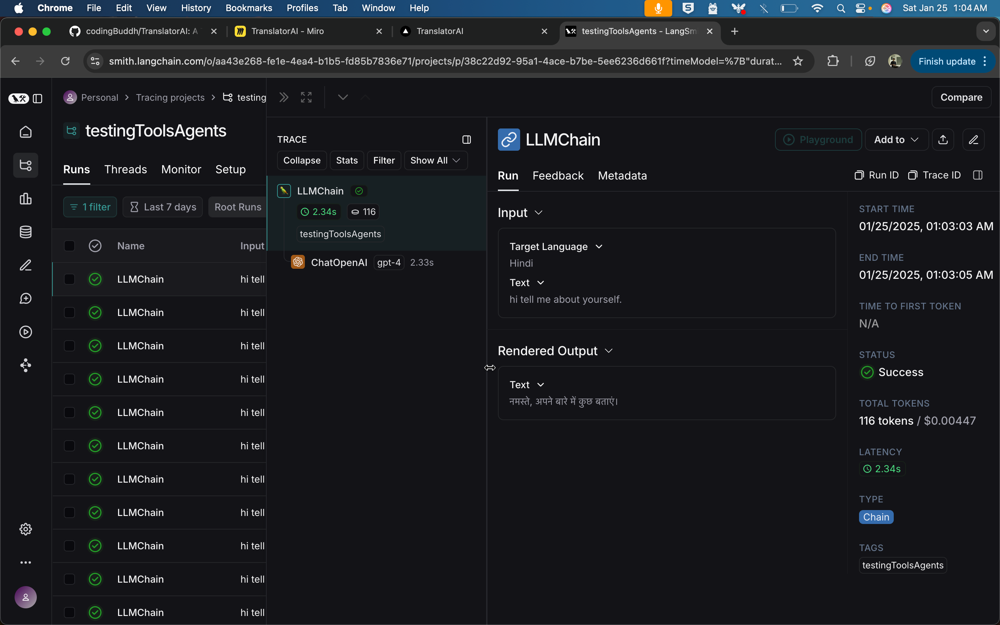

# TranslatorAI

TranslatorAI is a modern web application that provides AI-powered translation services using GPT-4o (optimized version). It supports translation between multiple languages with a clean, user-friendly interface and focuses on high-accuracy translations with zero temperature setting for consistent results.

## Screenshots

### V1.0.0 Multilanguage Interface

*The main translation interface with text input and language selection*

### Translation Example

*Example of translating text into Preffered languages*

### Monitoring and Analytics

*Langsmith monitoring and analytics*


## Features

- Text translation to multiple languages simultaneously
- Automatic source language detection
- Clean and responsive user interface
- Real-time translation feedback
- Support for HTML content cleaning
- Preservation of mathematical expressions and symbols
- Translation quality monitoring via LangSmith
- Zero-temperature translations for maximum accuracy
- Optimized GPT-4 model for better performance

## Tech Stack

### Backend
- FastAPI (Python web framework)
- LangChain (AI/LLM framework)
- OpenAI GPT-4o (Optimized model)
- LangSmith (for monitoring and analytics)

### Frontend
- React
- Material-UI
- Axios

## Prerequisites

- Python 3.11+
- Node.js 16+
- OpenAI API key
- LangSmith API key (optional, for monitoring)

## Installation

### Backend Setup

1. Clone the repository:
```bash
git clone https://github.com/yourusername/TranslatorAI.git
cd TranslatorAI
```

2. Create and activate a virtual environment:
```bash
python -m venv TranslatorEnv
source TranslatorEnv/bin/activate  # On Windows: TranslatorEnv\Scripts\activate
```

3. Install backend dependencies:
```bash
cd backend
pip install -r requirements.txt
```

4. Create a `.env` file in the backend directory:
```env
OPENAI_API_KEY=your_openai_api_key
LANGSMITH_API_KEY=your_langsmith_api_key  # Optional
LANGSMITH_PROJECT=translator-ai  # Optional
```

### Frontend Setup

1. Install frontend dependencies:
```bash
cd frontend
npm install
```

2. Create a `.env` file in the frontend directory:
```env
REACT_APP_API_URL=http://localhost:8000
```

## Running the Application

1. Start the backend server:
```bash
cd backend
uvicorn main:app --reload
```

2. Start the frontend development server:
```bash
cd frontend
npm start
```

The application will be available at:
- Frontend: http://localhost:3000
- Backend API: http://localhost:8000
- API Documentation: http://localhost:8000/docs

## Usage

1. Enter the text you want to translate in the main text field
2. Add one or more target languages using the "+" button
3. Click "Translate" to get translations
4. View the translations below the form

## API Endpoints

### POST /api/v1/translate
Translates text to multiple languages.

Request body:
```json
{
  "text": "Hello world",
  "target_languages": ["Spanish", "French"]
}
```

Response:
```json
{
  "translations": {
    "Spanish": {
      "text": "Hola mundo",
      "source_language": "English"
    },
    "French": {
      "text": "Bonjour le monde",
      "source_language": "English"
    }
  }
}
```

## Monitoring and Analytics

If you've configured LangSmith:
1. Visit https://smith.langchain.com
2. Login with your LangSmith account
3. View the "translator-ai" project for:
   - Translation quality metrics
   - Language detection accuracy
   - API usage statistics
   - Error tracking

## Error Handling

The application includes comprehensive error handling for:
- Invalid input text
- Unsupported languages
- API failures
- Network issues

## Limitations

- Maximum text length is determined by GPT-4o's token limit
- Translation quality depends on GPT-4o's capabilities
- Rate limiting based on OpenAI API limits
- Zero temperature setting means less creative but more accurate translations
- HTML markup is automatically removed for cleaner output

## Future Improvements

- Add support for file uploads
- Implement translation memory
- Add offline mode
- Support for more specialized domains (legal, medical, etc.)
- Batch processing for large texts

## Contributing

Contributions are welcome! Please feel free to submit a Pull Request.

## License

This project is licensed under the MIT License - see the LICENSE file for details.
